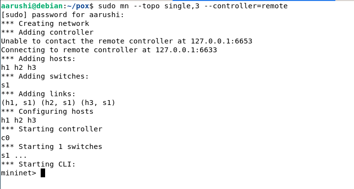
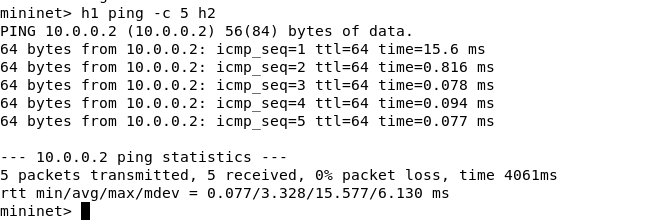
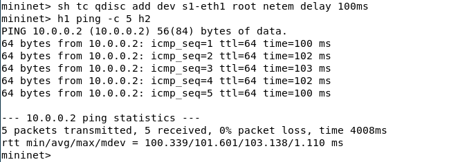
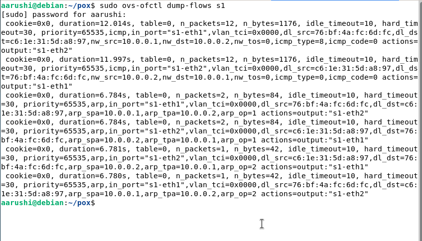

# Network Delay Measurement Tool

## 📌 Overview

This project measures and analyzes network delay (latency) between hosts using **Mininet** and **Software Defined Networking (SDN)**.

It uses the **ping command (ICMP protocol)** to calculate **RTT (Round Trip Time)** and a **Python script** to automate delay analysis.

---

## 🎯 Objectives

* Measure network delay using ping
* Record RTT values (min, average, max)
* Compare delay across different hosts
* Analyze delay variations using network emulation

---

## 🛠️ Technologies Used

* **Python** (for automation)
* **Mininet** (network emulation)
* **POX Controller** (SDN controller)
* **OpenFlow** (communication protocol)
* **Linux (Debian)**

---

## 🧠 Concepts Used

* **SDN (Software Defined Networking)**
* **Control Plane vs Data Plane**
* **Flow Tables (Match-Action rules)**
* **ICMP Protocol (ping)**
* **RTT (Round Trip Time)**
* **Packet-In & Flow Rule Installation**
* **Network Emulation (tc netem)**

---

## 🏗️ Network Topology

* 3 Hosts: h1, h2, h3
* 1 Switch: s1
* Remote SDN Controller (POX)

---

## ⚙️ Setup & Execution

### 1. Start Controller

```bash
cd ~/pox
python3 pox.py forwarding.l2_learning
```

---

### 2. Start Mininet

```bash
sudo mn --topo single,3 --controller=remote
```

---

### 3. Measure Delay (Baseline)

```bash
h1 ping -c 5 h2
```

---

### 4. Compare Across Hosts

```bash
h1 ping -c 5 h3
```

---

### 5. Run Python Script (RTT Analysis)

```bash
h1 python3 /home/aarushi/pox/delay_measure.py
```

---

### 6. Introduce Artificial Delay

```bash
sh tc qdisc add dev s1-eth1 root netem delay 100ms
```

---

### 7. Measure Delay Again

```bash
h1 ping -c 5 h2
```

---

### 8. View Flow Table

```bash
sudo ovs-ofctl dump-flows s1
```

---

## 📊 Results

### 🔹 Network Topology



---

### 🔹 Ping Output (Baseline)



---

### 🔹 Python RTT Analysis


---

### 🔹 Delay After Adding Network Latency



---

### 🔹 Flow Table (SDN Rules)



---

## 📌 Key Observations

* The **first packet has higher delay** due to controller interaction (packet-in)
* After flow rules are installed, **subsequent packets have lower delay**
* Artificial delay using netem increased RTT from ~3 ms to ~100 ms
* Python script successfully extracts and analyzes RTT values

---

## 🧠 Explanation

* **Ping uses ICMP** to measure delay
* **RTT = time taken for packet to go and return**
* In SDN:

  * First packet → goes to controller
  * Controller installs flow rule
  * Next packets → handled by switch (faster)

---

## 🏁 Conclusion

This project demonstrates how network delay can be measured and analyzed using RTT values, and how SDN dynamically controls packet forwarding using flow rules. It also shows how network conditions affect latency.

---

## 👩‍💻 Author

**Aarushi Singh**